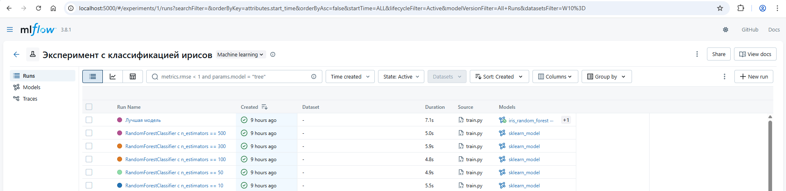
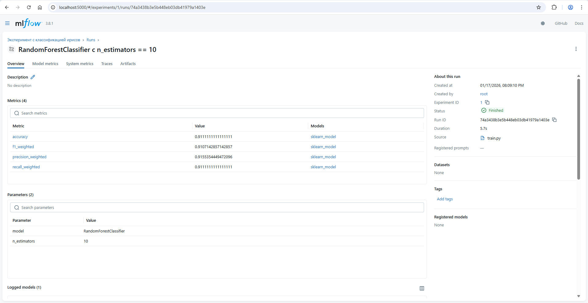
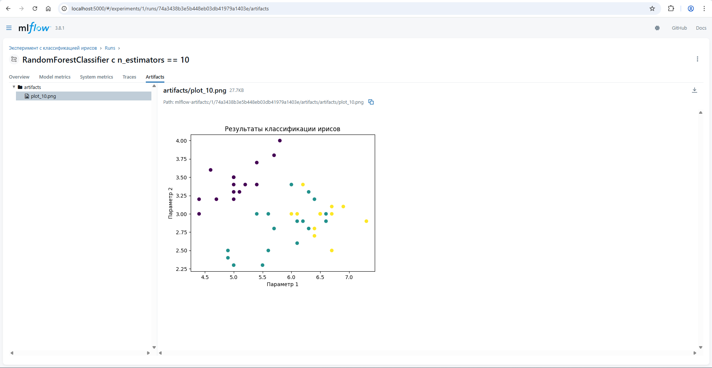
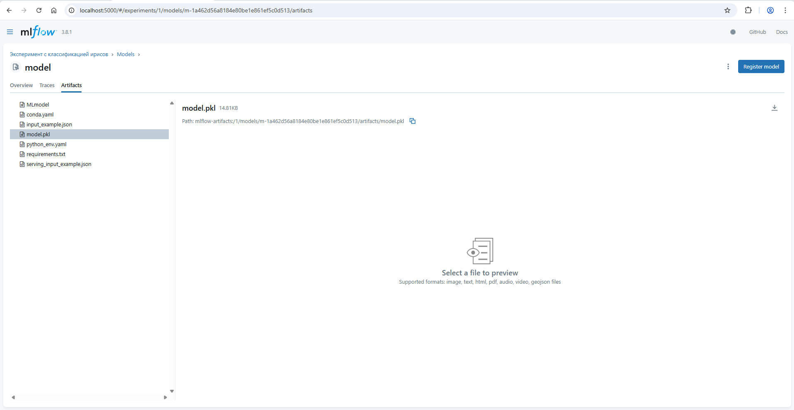
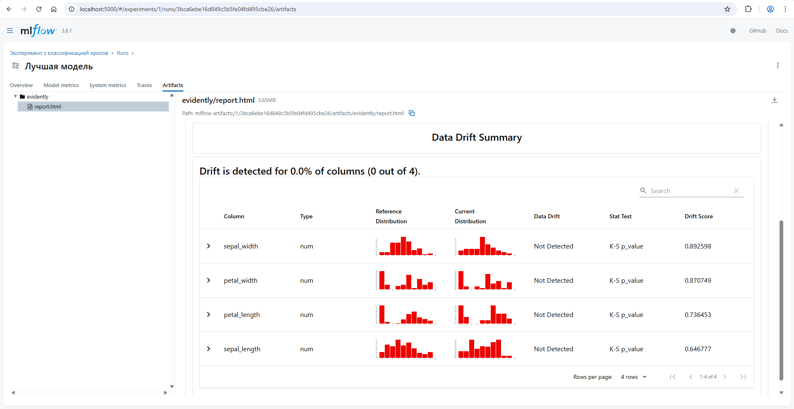
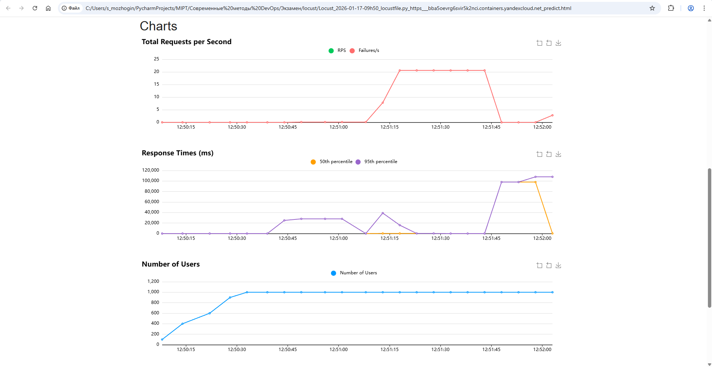
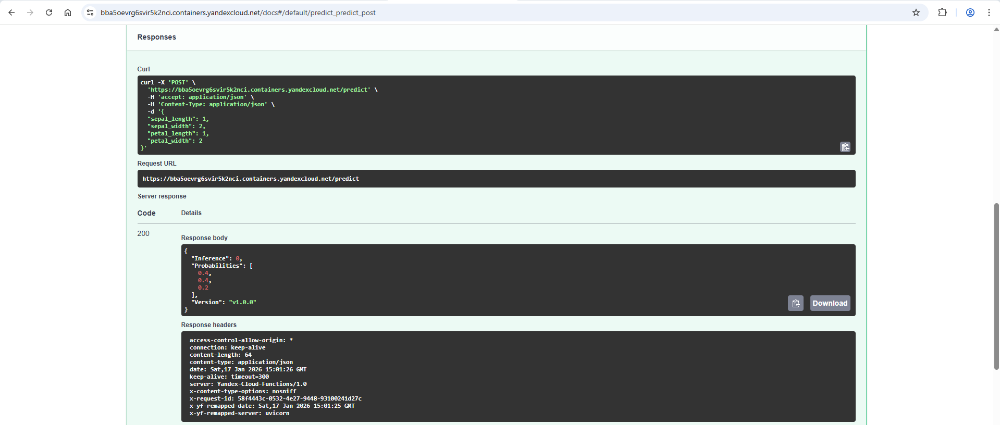

# Современные методы DevOps - Экзаменационное задание
**Автор:** Можогин Сергей Сергеевич, Науки о данных, 17.01.2026
- **Ссылка на репозиторий с публичным доступом в GitHub:** https://github.com/smozhogin/DevOps_Exam_Mozhogin_Sergey
- **Ссылка на контейнеризированное приложение в Yandex Cloud Serverless Containers:** https://bba5oevrg6svir5k2nci.containers.yandexcloud.net/docs
- **Ссылка на ноутбук по нагрузочному тестированию в Locust с публичным доступом в Google Colab:** https://colab.research.google.com/drive/1LhxauZqq7BWB0eWIH7ch3-6nwdvYswpN
- **Спецификация OpenAPI** находится в репозитории в файле **openapi.yaml**

## Несколько слов об отчете
Этот отчет сконвертирован в PDF из файла README.md, доступного в публичном репозитории GitHub по ссылке https://github.com/smozhogin/DevOps_Exam_Mozhogin_Sergey. Актуальная версия отчета хранится в репозитории.

## Микросервисная архитектура
Проект реализован в виде набора изолированных сервисов **Docker Compose**, каждый из которых решает одну задачу и масштабируется независимо:

**- app (inference / API):** Назначение - Публикация REST API для инференса и проверок состояния.

**- trainer (training job / pipeline):** Назначение - Обучение и переобучение модели.

**- mlflow (tracking / registry):** Назначение - Централизованный трекинг экспериментов и хранение артефактов.

## Проведение эксперимента в MLflow
Для проведения эксперимента использована модель **RandomForestClassifier** на классическом датасете с ирисами. В **MLflow** задан **"Эксперимент с классификацией ирисов"** с параметрами **n_estimators = [10, 50, 100, 300, 500]**. К каждому прогону фиксируются гиперпараметры модели, метрики на тестовой выборке, графики признаков и дамп модели в артефактах. Также регистрируется лучшая модель по средневзвешенному показателю **f1_score**.

Параметры эксперимента хранятся в репозитории в файле **params.yaml**.

Проведение эксперимента в MLflow:





## Анализ дрейфа в Evidently
Отчет хранится в репозитории по пути **evidently/report.html**.

Был проведен анализ дрейфа данных при обучении модели в скрипте **src/train.py**. Между обучающей и тестовой выборками дрейфа не обнаружено.

Отчет Evidently в артефактах MLflow:


## Интерпретация отчета Locust по нагрузочному тестированию
Отчет хранится в репозитории по пути **locust/Locust_2026-01-17-09h50_locustfile.py_https___bba5oevrg6svir5k2nci.containers.yandexcloud.net_predict.html**.

Был проведен анализ нагрузочного тестирования эндпойнта **/predict**, выполненного с помощью **Locust**. Несмотря на наличие ошибок обработки запросов, сервис не демонстрировал полного отказа под нагрузкой. В ходе тестирования сервис продолжал принимать и обрабатывать запросы, а нагрузка не приводила к остановке API. Ошибки носили частичный характер и не сопровождались деградацией до состояния недоступности, что свидетельствует о способности сервиса восстанавливаться и адаптироваться к нагрузке.

Основная часть ошибок была связана с ограничениями доступа (HTTP 403), а не с отказом сервиса, что подтверждает его устойчивость на уровне инфраструктуры. Это свидетельствует о временной перегрузке отдельных запросов.

Параметры запуска:
- Number of users: 1000
- Ramp up: 100
- Run time: 120s

Графики из отчета Locust:


## CI/CD сервиса app в Yandex Cloud Serverless Containers
В проекте реализован воркфлоу **GitHub Actions** (**.github/workflows/deploy.yml**) по деплою контейнеризированного приложения **app** в **Yandex Cloud Serverless Containers**.

Обновление облачного контейнера происходит при пуше в ветку **main** изменений:
```
api:
    - "app/**"
    - "src/**"
    - "params.yaml"
    - "Dockerfile.app"
    - "requirements_app.txt"
infra:
    - "infra/**"
    - ".github/workflows/**"
```

Функционал **IaC** реализован на **Terraform**. Файлы конфигурации хранятся в репозитории, в директории **infra**.

## Основные команды для воспроизведения функционала
```
# Разворачивание Docker-контейнеров локально:
docker-compose up -d
```
```
# Запуск экспериментов и обучение моделей локально:
docker compose -p devops_exam run --rm trainer
```
```
# Запуск приложений локально в браузере:
http://localhost:8000/docs # Контейнер "app"
http://localhost:5000 # Контейнер "mlflow"
```
```
# Пример обращения к эндпойнту /health в облачном приложении:
curl -X 'GET'   'https://bba5oevrg6svir5k2nci.containers.yandexcloud.net/health'   -H 'accept: application/json'
```
```
# Пример обращения к эндпойнту /predict в облачном приложении:
curl -X 'POST'   'https://bba5oevrg6svir5k2nci.containers.yandexcloud.net/predict'   -H 'accept: application/json'   -H 'Content-Type: application/json'   -d '{
  "sepal_length": 1,
  "sepal_width": 2,
  "petal_length": 1,
  "petal_width": 2
}'
```

Получение инференса модели в облачном приложении:


## Итоговые результаты работы
В рамках проекта реализовано микросервисное ML-приложение с применением практик **DevOps** и **MLOps**. Архитектура разделена на независимые сервисы для инференса модели, обучения и трекинга экспериментов, что обеспечивает изоляцию ответственности и упрощает масштабирование. **REST API** сервиса предоставляет доступ к предсказаниям модели и реализован с использованием **FastAPI**. Обучение моделей вынесено в отдельный сервис, который логирует параметры, метрики и артефакты в **MLflow**. Для контейнеризации и оркестрации используется **Docker Compose**, что позволяет воспроизводимо разворачивать проект в любой среде. В проекте также применяются инструменты мониторинга качества данных **Evidently** и нагрузочного тестирования **Locust** для оценки стабильности и производительности сервиса. Применяется цикл **CI/CD** в **GitHub Actions** для деплоя приложения в **Yandex Cloud Serverless Containers**. В качестве **IaC** использован **Terraform**.